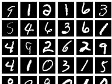

# Autoencoder
Autoencoder是一种无监督的学习方法。训练DNN需要大量的有标签数据，但是在某些领域中获得由标签的数据需要耗费大量的人力和财力。对于autoencoder而言，我们只需要构造一个encoder和encoder的镜像-decoder并最小化重建误差就能够让模型在大量的无标签数据中学习到数据的特征（也叫code）。对于具体的任务，我们只需要在encoder模块后面衔接其相应的其它模块，再用少量的有标签数据集对后者进行训练。这样大大减少了模型对于有标签数据的依赖。  
在这里，我使用一个小型的atuo-encoder来学习mnist数据集中的特征，然后再使用一个判别器-KNN来验证code的好坏。最终，KNN分类器在mnist数据集上的准确率达到了95%左右。这在一定程度上说明了encoder模块已经能够很好地学习了mnist数据集的表示。同时，我发现训练auto-encoder也是一个艰难的过程，因为auto-encoder包含了encoder和decoder两个模块，其参数量一般有监督模型的两倍之多。所以模型在经过少量的epoch后已经收敛，但是从可视化结果来看，重建结果的还原度还有待提升，即模型可能陷入了某一个局部极小值。当code的长度降低时，这种情况更加明显。如下所示：  
  
在Reducing The Dimensionality Of Data With Neural Networks中，Hinton提出了一种layer-by-layer的训练方法，该方法将encoder中的每一层当作是RMB，然后使用RMB的训练方法来预训练每一层的权重。不过由于本人对RMB不是特别了解，所以目前还没实现这种训练方法。
